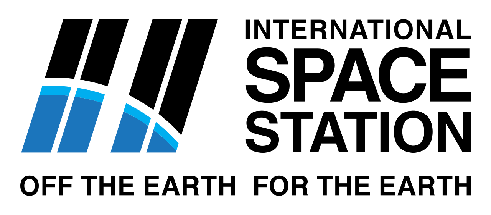

[![Contributors][contributors-shield]][contributors-url]
[![MIT License][license-shield]][license-url]

 

  

  <h3 align="center">Turing Tech ISS Tracker</h3>

  

    A 3D interactive tracker for the International Space Station, designed for the NASA Space Apps Challenge 2022.
     
    <a href="https://lucinne.github.io/track-the-iss-spaceapps2022/"><strong>Visit the tracker here! »</strong></a>
     
     
    <a href="https://2022.spaceappschallenge.org/challenges/2022-challenges/track-the-iss/teams/ccs-turing-tech/project">View project page</a>
    ·
    <a href="https://2022.spaceappschallenge.org/challenges/2022-challenges/track-the-iss/teams/ccs-turing-tech/members">View team members</a>
    ·
    <a>Discord Tag: thatonetanya#4248</a>
  

## About TT ISS Tracker

This tracker is a simple 3D interactive application that lets you track the ISS, its components, the Earth, the Moon and the Sun in their very exact position in space at this time.
You can also track the future orbit of the International Space Station with this application, allowing you to predict flybys and telemetry data of the ISS in the forseeable future.

## Usage of the TT ISS Tracker

The application is designed to be user-friendly, so there's no installation required. Just head over to the link given above and you will be able to load the TT ISS Tracker right in your browser, simple as that!

## License

This project is distributed under the MIT License. See `LICENSE` for more information.

(<a href="#readme-top">back to top</a>)

[contributors-shield]: https://img.shields.io/github/contributors/lucinne/track-the-iss-spaceapps2022?style=for-the-badge
[contributors-url]: https://github.com/lucinne/track-the-iss-spaceapps2022/graphs/contributors
[license-shield]: https://img.shields.io/github/license/lucinne/track-the-iss-spaceapps2022.svg?style=for-the-badge
[license-url]: https://github.com/lucinne/track-the-iss-spaceapps2022/blob/main/LICENSE
